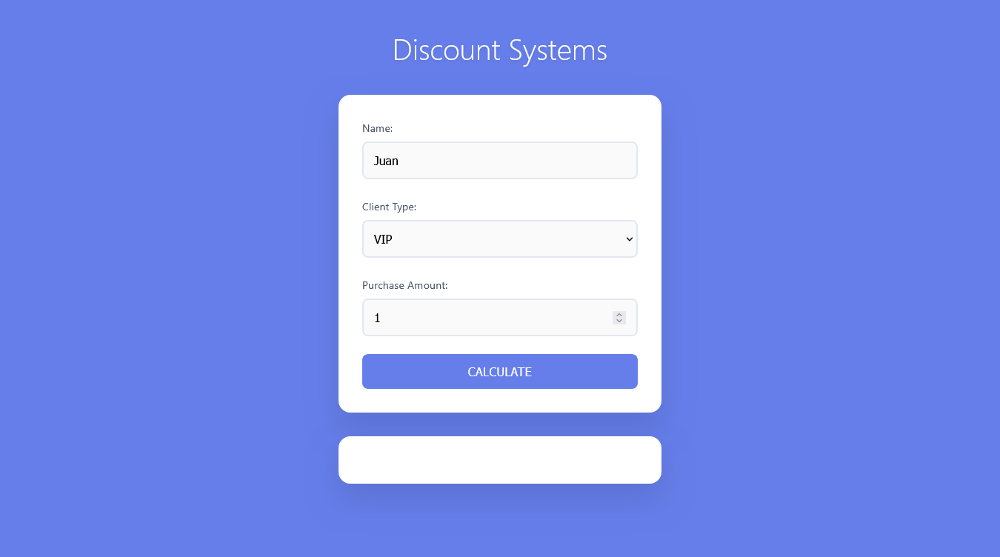

<!-- README.md -->

# Discount Systems



## Table of Contents

- [Discount Systems](#discount-systems)
  - [Table of Contents](#table-of-contents)
  - [Description](#description)
  - [How it works](#how-it-works)
  - [Project Structure](#project-structure)
  - [Requirements](#requirements)
  - [Usage](#usage)
  - [Features](#features)

## Description

A modern, minimalist web application for calculating customer discounts based on client type and purchase amount. The application features a clean interface with smooth animations and responsive design.

## How it works

1. The user enters their name, selects customer type, and inputs the purchase amount.
2. The system validates the input and applies discount rules:
   - **New customers**: No discount (0%)
   - **Regular customers**: 5% discount for purchases ≥ $100,000, otherwise 0%
   - **VIP customers**: 15% discount on any purchase
3. The result is displayed showing the original amount, discount applied, and final price.

## Project Structure

```plaintext
Discount Systems/
├── README.md
└── src/
    ├── index.html          # Main HTML file with user interface
    ├── scripts/
    │   ├── main.js         # Entry point and initialization
    │   └── modules/
    │       ├── logic.js    # Form handling and event management
    │       └── process.js  # Discount calculation logic
    ├── styles/
    │   └── global.css      # All styling and responsive design
    └── assets/
        └── discount-preview.png
```

- `index.html`: User interface with form inputs and result display.
- `main.js`: Application initialization and module coordination.
- `logic.js`: Form event handling and data processing.
- `process.js`: Discount calculation algorithms and business logic.
- `global.css`: Modern styling with animations and responsive design.

## Requirements

- Modern web browser with JavaScript support.
- Clean, modular code architecture with proper separation of concerns.
- Responsive design that works on desktop and mobile devices.
- Form validation and error handling for user inputs.

## Usage

1. Open `src/index.html` in your web browser.
2. Fill in the required information:
   - Enter your name
   - Select customer type (New, Regular, or VIP)
   - Input purchase amount
3. Click submit to see the discount calculation and final price.

## Features

- **Customer Classification**: Support for New, Regular, and VIP customers
- **Dynamic Discount Calculation**: Automatic discount application based on customer type and purchase amount
- **Modern UI**: Clean, minimalist design with smooth animations
- **Responsive Design**: Works perfectly on desktop and mobile devices
- **Real-time Results**: Instant calculation display without page refresh
- **Modular Architecture**: Organized code structure for maintainability
