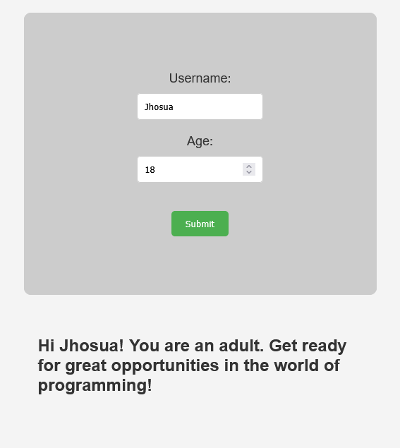

<!-- README.md -->

# Interactive Message System



## Table of Contents

- [Interactive Message System](#interactive-message-system)
  - [Table of Contents](#table-of-contents)
  - [Description](#description)
  - [How it works](#how-it-works)
  - [Project Structure](#project-structure)
  - [Requirements](#requirements)
  - [Usage](#usage)
  - [Testing](#testing)

## Description

A JavaScript application that asks the user for their **name** and **age**, displaying personalized messages based on the entered age.

## How it works

1. The user enters their name and age in the web form.
2. The system validates the age:
   - If under 18, it shows an encouraging message for students.
   - If 18 or older, it shows a message for adults.
   - If the age is invalid, it displays an error message.
3. The result is shown on the web page.

## Project Structure

```plaintext
Interactive Message System/
├── README.md
└── src/
    ├── pages/
    │   └── index.html
    ├── scripts/
    │   ├── index.js
    │   └── message.js
    ├── tests/
    │   └── index.test.js
    ├── styles/
    │   └── index.css
    └── assets/
        ├── adult.png
        ├── invalid.png
        └── minor.png
```

- `index.html`: User interface.
- `index.js`: Logic for handling user input and displaying the result.
- `message.js`: Logic for generating personalized messages.
- `styles/`: CSS styles for the application.
- `assets/`: Images for the application.

## Requirements

- Good programming practices and commented code.
- Clear structure and documentation.
- Manual tests with different inputs (under 18, 18 or older, invalid age).

## Usage

1. Open `src/pages/index.html` in your browser.
2. Enter the requested data and check the displayed message.

## Testing

To run the tests for the message logic:

1. Make sure you have [Node.js](https://nodejs.org/) installed.
2. Open a terminal in the project root directory.
3. Run:

   ```sh
   npm test
   ```

This will execute the test cases for the message functions and show the results in the terminal.
